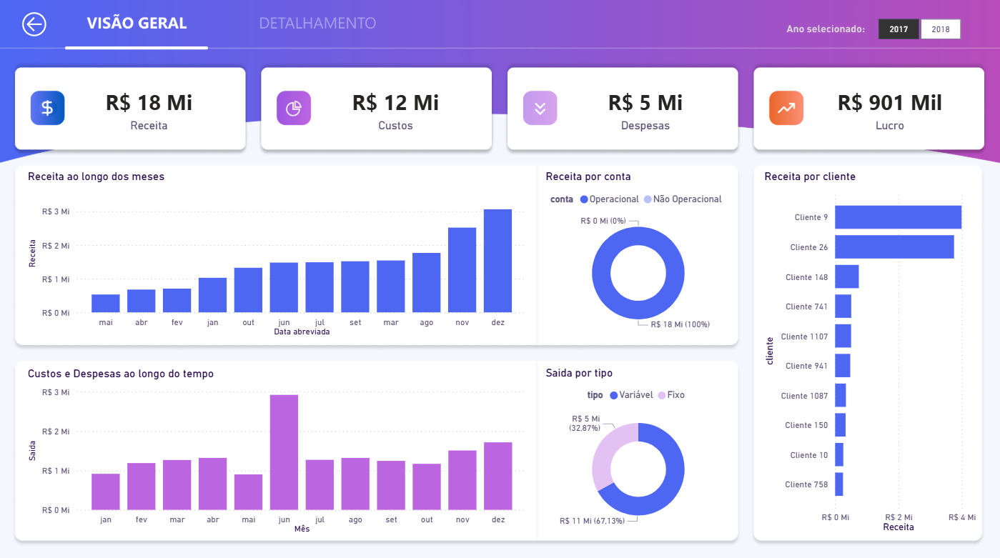
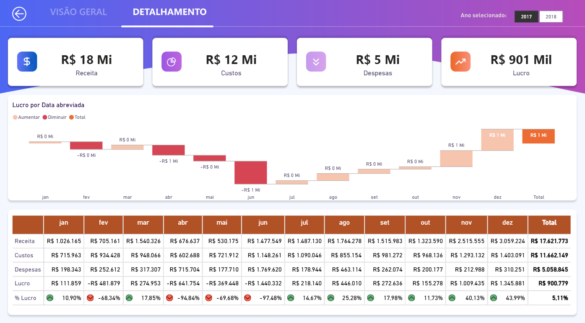

# 📊 Finance Dashboard BI - Gestão de Fluxo e DRE

Olá ! Este projeto consiste em um dashboard financeiro interativo desenvolvido no Power BI, focado na análise detalhada de Receitas, Custos, Despesas e Lucratividade. O objetivo é transformar dados brutos de pagamentos e recebimentos em insights estratégicos para a tomada de decisão.

( Obs: O Dataset é fictício gerado para fins didáticos baseado em cenários reais de ERP )

## 🔗 Acesso ao Projeto
> **[CLIQUE AQUI PARA ACESSAR O DASHBOARD INTERATIVO](https://app.powerbi.com/view?r=eyJrIjoiOWNmZGU1YjUtMjYyMS00MDQzLThhZWMtYTZjZTA0NmY5ZmJlIiwidCI6ImRlOGIwYjdlLTM2NGMtNDFiOS1iZDgzLWIxYjJmYjNiYzBiMSJ9&pageName=9f8274f76f8b4db9a0f2)**

---

## 📷 Screenshots do Dashboard

### 1. Visão Geral (Overview)
Focada nos principais KPIs e distribuição de receitas por cliente e tipo de conta.

### 2. Detalhamento Financeiro
Uma visão técnica com gráfico de cascata e tabela dinâmica de lucratividade mensal.

---

## 🛠️ Tecnologias e Ferramentas
* **Power BI**: Modelagem, DAX e Visualização.
* **Power Query**: Limpeza e tratamento dos dados.
* **Figma**: Design de background.
* **Datasets**: Arquivos de Cadastro, Pagamentos e Recebimentos.

## 📈 Funcionalidades Principais
* **Análise de Margem de Lucro**: Cálculo dinâmico de lucratividade com indicadores visuais.
* **Fluxo de Receitas e Saídas**: Monitoramento mensal de entradas vs. saídas fixas e variáveis.
* **Análise de Pareto**: Visualização clara de quais clientes geram mais impacto na receita.
* **Gráfico de Cascata**: Demonstração da variação do lucro ao longo dos meses.

## 🗄️ Modelagem de Dados
O projeto utiliza um modelo baseado em:
1.  **CadastroPlanoContas**: Estrutura de categorias financeiras.
2.  **Recebimentos**: Histórico de entradas financeiras por cliente.
3.  **Pagamentos**: Histórico de saídas.

---

## 🧑‍💻 Autor
Desenvolvido por **Rafael Torres**. 
Conecte-se comigo no [LinkedIn](https://www.linkedin.com/in/rafael-torres-vince-nascimento-a2283b217/)!
